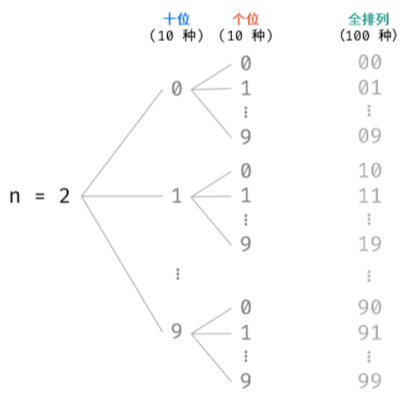

# 17. 打印从1到最大的n位数

[力扣题目链接](https://leetcode-cn.com/problems/da-yin-cong-1dao-zui-da-de-nwei-shu-lcof/)


# 初见思路

## 基本思路
遍历数组，将$1\sim 10^{n}-1$填入到结果数组中

## 边界问题
如果`n<0`，则返回`null`

## Java代码
```java
class Solution {
    public int[] printNumbers(int n) {
        if (n < 0){
            return null;
        }
        int[] res = new int[(int) Math.pow(10, n) - 1];
        for (int i = 0; i < res.length; i++){
            res[i] = i + 1;
        }
        return res;
    }
}
```

## 复杂度分析
- 时间复杂度：$O(10^{n})$
- 空间复杂度：$O(1)$，返回结果的数组不计入空间

# 民间解法

## 基本思路(大数问题)
本题实际上需要考虑**大数越界问题**，当`n`较大时，$10^{n}-1$会超出`int`型的取值范围，超出取值范围的数字无法正常存储，例如`n=10`，$10^{n}-1=9,999,999,999$，则`2,147,483,648~9,999,999,999`范围内的数字会超出`int`型的取值范围

所以这里需要使用字符串来保存结果，默认返回值为`String`型

由于`String`型的数字进位操作效率较低，例如 `"9999"` 至` "10000" `需要从个位到千位循环判断，进位 `4` 次，所以按照前面的思路将`"1" ~ "10^(n)-1"`依次拼接到结果中显然实现起来非常麻烦。观察可知，生成的列表实际上是 `n` 位 `0 - 9` 的**全排列** ，因此可避开进位操作，<strong>通过递归生成数字的 `String` 列表</strong>



- 用`i`表示要生成的数字的位数，本题要从`1`位数一直生成到`n`位数，将生成的`i`位数保存到长度为`i`的`char`数组`numInCharArr`中，另外，<strong>为了避免数字开头出现`0`，先把数字的首部（`char`数组的第一位字符）固定为``'1'~'9'``</strong>
	- 生成1位数使用一个长度为`1`的`char`数组保存依次生成的`"1"~"9"`
	- 生成2位数使用一个长度为`2`的`char`数组保存依次生成的`"10"~"99"`
	- 生成3位数时使用一个长度为`3`的`char`数组保存依次生成的`"100"~"999"`

- 生成首位之后进入递归，从高位字符（索引为`1`的字符）出发，递归生成低位的字符，这些字符从`'0'~'9'`中取值
- 递归的基线条件为已经生成了`i`位（即`char`数组`numInCharArr`的长度）的数字，即`index == numInCharArr.length`，将此时的`char`数组`numInCharArr`拼接到保存结果的`StringBuilder`中

最后将`StringBuilder`转成`String`返回即可


## Java代码
```java
class Solution {
    StringBuilder sb = new StringBuilder();//属性，用于保存结果
    public String printNumbers(int n) {
        if (n < 0){
            return null;
        }

        for (int i = 1; i <= n; i++){//以char[]的形式依次生成"1"~"9"(i=1，保存到长度为1的char数组), "10"~"99"(i=2，保存到长度为2的char数组), "100"~"999"(i=3，保存到长度为3的char数组)...
            char[] numInCharArr = new char[i];
            for (char ch = '1'; ch <= '9'; ch++){//固定第一位字符为非'0'
                numInCharArr[0] = ch;
                //从高位字符（索引为1的字符，因为索引为0的字符已经被固定）出发，递归生成低位的字符
                dfs(1, numInCharArr);
            }
        }
        //最后结果的形式为"1,2,...,10,11,...,99,100,101,...,999,..."
        sb.deleteCharAt(sb.length() - 1);//别忘了删除最后一个逗号
        return sb.toString();
    }

    public void dfs(int index, char[] numInCharArr){
        if (index == numInCharArr.length){//基线条件
            sb.append(numInCharArr).append(',');
            return;
        }
        for (char ch = '0'; ch <= '9'; ch++){
            numInCharArr[index] = ch;
            dfs(index + 1, numInCharArr);
        }
    }
}
```

## 复杂度分析
- 时间复杂度：$O(10^{n})$
- 空间复杂度：$O(n)$，返回结果的字符串不计入空间，递归栈需要$O(n)$的空间，`char`数组`numInCharArr`需要$O(n)$的空间